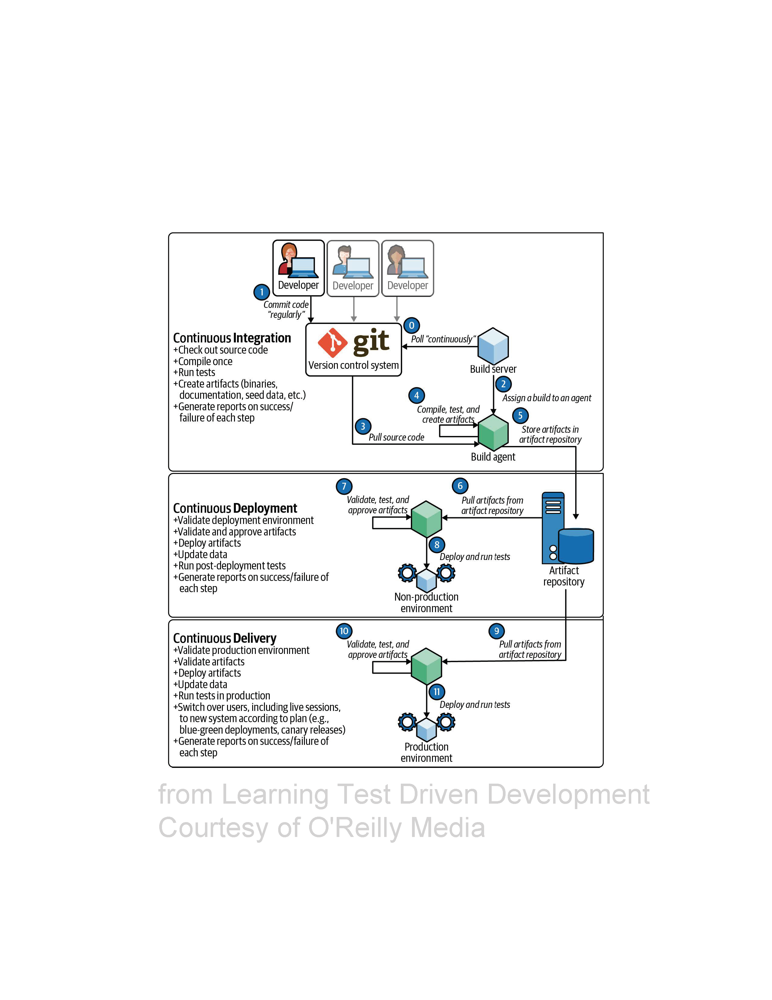

# Learning Test-Driven Development (TDD)
* Workshop to learn TDD step-by-step from [Saleem Siddiqui](https://www.linkedin.com/in/ssiddiqui/) 's book : 
  * [Learning Test-Driven Development](https://www.oreilly.com/library/view/learning-test-driven-development/9781098106461/)
    * The book explains the different concepts in 3 languages : Go, Python, JS
    * Thanks Saleem for your great sharing
* You will find other languages in this repository : `C#`, `scala`
  * I have chosen to make a step-by-step guide from the book in `C#`
  
[](https://www.oreilly.com/library/view/learning-test-driven-development/9781098106461/)

## What is TDD
TDD is a technique borne of a set of beliefs about code :  

* Simplicity - the art of maximizing the amount of work *not* done
* Obviousness and clarity are more virtuous than cleverness
* Writing uncluttered code is a key component of being successful

`Test-Driven Development is a way of managing fear during programming - Kant Beck`

### Designing and structuring code
* TDD is not fundamentally about testing code
* Its purpose : `improve the design and structure of the code`
	* The Unit Tests that we end up with are an added bonus
	* Primary benefit : simplicity of design we get

### A bias toward simplicity
* In software we can measure simplicity :
	* Fewer lines of code per feature
	* Lower Cyclomatic Complexity
	* Fewer side effects
	* Smaller runtime / memory requirements
* TDD forces us to craft the simplest thing that works
* Virtue isn't mystical :
	* Using TDD won't cut by half :
		* your development time
		* the lines of code
		* defect count
	* It will allow you to arrest the temptation to introduce artificial / contrived complexity

### Increased Confidence
TDD increases our confidence in our code :

* Each new test flexes the system in new and previously untested ways
* Over time : the tests suite guards us against regression failures

## Part 1 - Getting Started
### Chapter 1 - The money problem
#### Building block of TDD
A 3-phase process :

* ***Red*** : We write a failing test
	* Including possible compilation failures
	* We run the test suite to verify the failing test
* ***Green*** : We write **just enough production code** to make the test green
	* We run the test suite to verify this
* ***Refactor*** : We remove any code smells
	* Duplication, hardcoded values, improper use of language idioms, ...
	* If we break any test during this phase :
		* Prioritize getting back to green before exiting this phase


### What's the problem ?
We have  to builkd a spreadsheet to manage money in more than one currency : perhaps to manage a stock portfolio ?

| Stock | Stock exchange | Shares | Share Price | Total |
|---|---|---|---|---|
| IBM | NASDAQ | 100 | 124 USD | 12400 USD |
| BMW | DAX | 400 | 75 EUR | 30000 EUR |
| Samsung | KSE | 300 | 68000 KRW | 20400000 KRW |

To build it, we'd need to do simple arithmetic operations on numbers :

```text
5 USD x 2 = 10 USD
4002 KRW / 4 = 1000.5 KRW

// convert
5 USD + 10 EUR = 17 USD
1 USD + 1100 KRW = 2200 KRW
```

List of Features to implement :

```text
5 USD x 2 = 10 USD
10 EUR x 2 = 20 EUR
4002 KRW / 4 = 1000.5 KRW
5 USD + 10 EUR = 17 USD
1 USD + 1100 KRW = 2200 KRW
```

### Our first failing test
* Create a new dotnet project called `money-problem` :

```shell
dotnet new xunit -n "money-problem"
dotnet test
```

* Write our first test for
  * `5 USD x 2 = 10 USD`
  * This code does not compile
  * Congrats here is our failing test

```c#
public class TestMoney
{
    [Fact]
    public void TestMultiplication()
    {
        var fiver = new Dollar(5);
        var tenner = fiver.Times(2);

        tenner.Amount.Should().Be(10);
    }
}
```

### Going for Green
* We wrote our tests as we would expect them to work
* Start with the smallest bit of code that sets up on the path to progress
  * Add an abstraction `Dollar`
  * Use IDE for that

```c#
public record Dollar(int Amount)
{
    public Dollar Times(int multiplier) => new(10);
}
```

### Cleaning Up
* Just enough code to make the test pass
* Remove hardcoded values

```c#
public record Dollar(int Amount)
{
    public Dollar Times(int multiplier) => new(Amount * multiplier);
}
```

### Chapter 2 - Multi-currency Money
* Second item in our feature list : `10 EUR x 2 = 20 EUR`
* We need a more general concept than `Dollar`
    * Money for example 

#### Let's write our new test
```c#
[Fact]
public void TestMultiplicationInEuro()
{
    var tenEuros = new Money(10, "EUR");
    var twentyEuros = tenEuros.Times(2);

    twentyEuros.Amount.Should().Be(20);
    twentyEuros.Currency.Should().Be("EUR");
}
```

#### Make it green
```c#
public record Money(int Amount, string Currency)
{
    public Money Times(int multiplier) => this with { Amount = Amount * multiplier };
}
```

#### DRY - Remove duplication
* We now have 2 classes that could be simplified

```c#
public record Money(int Amount, string Currency)
{
    public Money Times(int multiplier) => this with { Amount = Amount * multiplier };
}

public record Dollar(int Amount)
{
    public Dollar Times(int multiplier) => new(Amount * multiplier);
}
```

* What else ?
  * We repeat "EUR" in our tests
  * Create a struct representing the supported currencies

```c#
namespace money_problem
{
    public class TestMoney
    {
        [Fact]
        public void MultiplicationInUsd()
        {
            var fiver = new Money(5, Currency.USD);
            var tenner = fiver.Times(2);

            tenner.Amount.Should().Be(10);
            tenner.Currency.Should().Be(Currency.USD);
        }
    
        [Fact]
        public void MultiplicationInEuro()
        {
            var tenEuros = new Money(10, Currency.EUR);
            var twentyEuros = tenEuros.Times(2);

            twentyEuros.Amount.Should().Be(20);
            twentyEuros.Currency.Should().Be(Currency.EUR);
        }
    }

    public record Money(int Amount, Currency Currency)
    {
        public Money Times(int multiplier) => this with { Amount = Amount * multiplier };
    }

    public enum Currency { EUR , USD }
}
```

#### Divide and Conquer
* Allow division on `Money` : `4002 KRW / 4 = 1000.5 KRW`
* Write the test

```c#
[Fact(DisplayName = "4002 KRW / 4 = 1000.5 KRW")]
public void Division()
{
    var originalMoney = new Money(4002, Currency.KRW);
    var actualMoneyAfterDivision = originalMoney.Divide(4);

    actualMoneyAfterDivision.Should().Be(new Money(1000.5, Currency.KRW));
}
```

#### Make it green
* We need to change the type of Amount -> in double now
* We must add a new Currency

```c#
public record Money(double Amount, Currency Currency)
{
    public Money Times(int multiplier) => this with { Amount = Amount * multiplier };
    public Money Divide(int divisor) => this with {Amount = Amount / divisor};
}

public enum Currency { EUR , USD, KRW }
```

* Using `DisplayName` in the `Fact Attribute` allows us to have this in our test results
* 

#### Cleaning Up
* Remove duplication
  * We assert always the same stuff

```c#
[Fact(DisplayName = "5 USD x 2 = 10 USD")]
public void MultiplicationInUsd()
{
    var fiver = new Money(5, Currency.USD);
    var tenner = fiver.Times(2);

    tenner.Amount.Should().Be(10);
    tenner.Currency.Should().Be(Currency.USD);
}

[Fact(DisplayName = "10 EUR x 2 = 20 EUR")]
public void MultiplicationInEuro()
{
    var tenEuros = new Money(10, Currency.EUR);
    var twentyEuros = tenEuros.Times(2);

    twentyEuros.Amount.Should().Be(20);
    twentyEuros.Currency.Should().Be(Currency.EUR);
}

[Fact(DisplayName = "4002 KRW / 4 = 1000.5 KRW")]
public void Division()
{
    var originalMoney = new Money(4002, Currency.KRW);
    var actualMoneyAfterDivision = originalMoney.Divide(4);

    actualMoneyAfterDivision.Amount.Should().Be(1000.5);
    actualMoneyAfterDivision.Currency.Should().Be(Currency.KRW);
}
```

* We can use record value equality to simplify assertions

```c#
[Fact(DisplayName = "5 USD x 2 = 10 USD")]
public void MultiplicationInUsd()
{
    var fiveDollars = new Money(5, Currency.USD);
    fiveDollars.Times(2)
        .Should()
        .Be(new Money(10, Currency.USD));
}

[Fact(DisplayName = "10 EUR x 2 = 20 EUR")]
public void MultiplicationInEuro()
{
    var tenEuros = new Money(10, Currency.EUR);
    tenEuros.Times(2)
        .Should()
        .Be(new Money(20, Currency.EUR));
}

[Fact(DisplayName = "4002 KRW / 4 = 1000.5 KRW")]
public void Division()
{
    var originalMoney = new Money(4002, Currency.KRW);
    originalMoney.Divide(4)
        .Should()
        .Be(new Money(1000.5, Currency.KRW));
}
```

#### Where we are ?
* We built a second feature : `division`
* We changed our design to deal with numbers with fractions
* We have a couple of passing tests
* We have introduced a `Money` entity to deal with various currencies
* We cleaned our code along the way

```text
✅ 5 USD x 2 = 10 USD 
✅ 10 EUR x 2 = 20 EUR
✅ 4002 KRW / 4 = 1000.5 KRW
5 USD + 10 EUR = 17 USD
1 USD + 1100 KRW = 2200 KRW
```

### Chapter 3 - Portfolio
* We can multiply and divide amounts in any one currency by numbers
* Now we need to add amounts in multiple currencies

#### Designing our Next Test
`5 USD + 10 EUR = 17 USD`  
* TDD plays nicely with software design
  * TDD gives us an opportunity to pause after each RGR cycle and design our code intentionally
* We realize with this feature that "adding dollars to dollars results in dollars" is an oversimplification
* Adding `Money` entities in different currencies gives us a `Portfolio
  * That can be expressed in any one currency
* We just introduced a new concept
  * Let's reflect this reality in our domain model

* Let's start with a test to add 2 `Money` entities in the same currency : `5 USD + 10 USD = 15 USD`

* Create our first `Portfolio` test :
```c#
[Fact(DisplayName = "5 USD + 10 USD = 15 USD")]
public void Addition()
{
    var fiveDollars = new Money(5, Currency.USD);
    var tenDollars = new Money(10, Currency.USD);
    
    // Declare an empty Portfolio
    var portfolio = new Portfolio();
    // Add multiple Money in it
    portfolio.Add(fiveDollars, tenDollars);
    // Evaluate the Portfolio in a given currency
    portfolio.Evaluate(Currency.USD)
        .Should()
        .Be(new Money(15, Currency.USD));
}
```

* Use our IDE to implement missing methods amd make our test green

```c#
public class Portfolio
{
    private readonly List<Money> _moneys = new();
    public void Add(params Money[] moneys) => _moneys.AddRange(moneys);
    public Money Evaluate(Currency currency) => new(15, Currency.USD);
}
```

* Refactor
  * Where is the duplication / code smells ?
  * Let's work on the hardcode values : 15 / USD
    * We can simply sums up moneys

```c#
public class Portfolio
{
    private readonly List<Money> _moneys = new();
    public void Add(params Money[] moneys) => _moneys.AddRange(moneys);
    public Money Evaluate(Currency currency) =>
        new(_moneys.Aggregate(0d, (acc, money) => acc + money.Amount), currency);
}
```

* Do we really need to have a state in Portfolio ?
  * Let's refactor it to only have Pure functions and immutable data structure
  * It's a design choice

```c#
[Fact(DisplayName = "5 USD + 10 USD = 15 USD")]
public void Addition()
{
    var fiveDollars = new Money(5, Currency.USD);
    var tenDollars = new Money(10, Currency.USD);

    var portfolio = new Portfolio(fiveDollars, tenDollars);
    portfolio.Evaluate(Currency.USD)
        .Should()
        .Be(new Money(15, Currency.USD));
}

public record Portfolio(params Money[] Moneys)
{
    public Money Evaluate(Currency currency) =>
        new(Moneys.Aggregate(0d, (acc, money) => acc + money.Amount), currency);
}
```

#### Where we are ?
* We started to tackle the problem of adding different representations of `Money`
  * This requires introduction of exchange rates
* We used a divide-and-conquer strategy to 
  * Add 2 `Money entities` (through constructor here)
  * And evaluate in the same currency
* We can notice that our code is growing
  * We need to restructure it : separate our tests from production code

```text
✅ 5 USD x 2 = 10 USD 
✅ 10 EUR x 2 = 20 EUR
✅ 4002 KRW / 4 = 1000.5 KRW
✅ 5 USD + 10 USD = 15 USD
5 USD + 10 EUR = 17 USD
1 USD + 1100 KRW = 2200 KRW
```

## Part 2 - Modularization
### Chapter 4 - Separation of Concerns
* Our source code has grown
* Let's spend some time organizing it

#### Test and Production Code
We have written 2 types of code :
1. Code that `solves` our `Money` problem
  * Including `Money` / `Portfolio`
  * We call this `production code`
2. Code that `verifies the problem is correctly solved`
   * Including all the tests and the code needed to support these tests
   * We call this `test code`

`Test code depends on production code, however there should be no dependency in the other direction`

#### Packaging and Deployment
`Test code should be packaged separately from production code so that they can be deployed independently via CI/CD pipeline`
* Modularization
  * Let's separate the test code from the production code
* This means :
  * Test and production code should be in separate files
    * Allows to read / edit / focus on test or production code independently
  * The code should use namespaces to clearly identify which entities belong together
    * A namespace may be called a "module" or "package'
  * Add explicit `import` in our test code

#### Removing redundancy
* We have had 2 multiplication tests
  * They test the same functionality
  * In contrast we have only one test for division
  * `Should we keep both the multiplication tests ?`

#### Checklist for cleaning tests :
- [ ] Would we have the same code coverage if we delete a test ?
- [ ] Does one of the tests verify a significant edge case ?
- [ ] Do the different tests provide unique value as a `living documentation` ?

#### Update our feature list
```text
✅ 5 USD x 2 = 10 USD 
✅ 10 EUR x 2 = 20 EUR
✅ 4002 KRW / 4 = 1000.5 KRW
✅ 5 USD + 10 USD = 15 USD
Separate test code from production code
Remove redundant tests
5 USD + 10 EUR = 17 USD
1 USD + 1100 KRW = 2200 KRW
```

The steps of separation of concerns vary from language to language. Saleem has dedicated 3 chapters in his boook on this topic :
* Chapter 5, "Packages and Modules in Go"
* Chapter 6, "Modules in Javascript"
* Chapter 7, "Modules in Python"

I propose here how I would do that in C#.

### Chapter "custom" Projects and namespaces in C#
#### Splitting Our Code into Classes
* Start our separation of concerns by splitting our file into distinct Classes
```
money-problem
│─── Currency.cs
│─── Money.cs    
│─── Portfolio.cs
│─── MoneyShould.cs
│─── PortfolioShould.cs
```

#### Separate Production code and Test Code
* Let's isolate our Test code by creating a new Project for `production code`
* To do it, we have some prerequisites :
  * Create an empty solution `money-problem`
  * Create a folder for `money-problem.Tests`
    * Move actual files in this folder
  * Add the existing project `money-problem.Tests` to the solution
* Create a new project (`Class Library`)
  * Name it `money-problem.Domain`
  * Move `Domain entities` to it
  * Our tests are now `Red`
    * Add dependency to the `Domain` project in the `Tests` project
    * Dependency is unidirectional so we can not reference test objects from our `production code`

```
money-problem   
│─── money-problem.Domain
│        │─── Currency.cs
│        │─── Money.cs    
│        │─── Portfolio.cs
│─── money-problem.Tests
│        │─── MoneyShould.cs
│        │─── PortfolioShould.cs
```

#### Fix our tests
* Our tests are not compiling anymore
* We need to fix `usings` in our tests : 
```c#
using money_problem.Domain;
```

#### Remove Redundancy in Tests
* We have 2 tests on multiplication
  * The 2 tests test the same functionality and does not provide any added-value according to our check-list :

- [X] Would we have the same code coverage if we delete a tests ?
- [ ] Does one of the tests verify a significant edge case ?
- [ ] Do the different tests provide unique value as a `living documentation` ?

* Delete the `MultiplyInDollars`
  * Rename the tests to represent the features under tests :
  * Add / Divide / Multiply

#### Update our feature list
```text
✅ 5 USD x 2 = 10 USD 
✅ 10 EUR x 2 = 20 EUR
✅ 4002 KRW / 4 = 1000.5 KRW
✅ 5 USD + 10 USD = 15 USD
✅ Separate test code from production code
✅ Remove redundant tests
5 USD + 10 EUR = 17 USD
1 USD + 1100 KRW = 2200 KRW
```

## Part 3 - Features and Redesign
### Chapter 8 - Evaluating a Portfolio
`Money itself isn't lost or made. It's simply transfered from one perception to another. Like magic. - Gordon Gekko, Wall Street`

#### Mixing Money
Heterogeneous combination of currencies demands that we create a new abstraction : conversion of money from one currency to another :
```text
- Conversion always relates a pair of currencies
- Conversion is from one currency to another with a well-defined exchange rate
- The two exchange rates between a pair of currencies may or may not be arithmetical reciprocals of each other
    - Exchange Rate from EUR to USD may or may not be the mathematical reciprocal of USD to EUR
- It is possible for a currency to have no defined exchange rate to another currency
    - Inconvertible currencies : economical, political, ... reasons    
```

* Add our next test :

```c#
[Fact(DisplayName = "5 USD + 10 EUR = 17 USD")]
public void AddDollarsAndEuros()
{
    var fiveDollars = new Money(5, Currency.USD);
    var tenEuros = new Money(10, Currency.EUR);

    var portfolio = new Portfolio(fiveDollars, tenEuros);
    portfolio.Evaluate(Currency.USD)
        .Should()
        .Be(new Money(17, Currency.USD));
}
```

* We need an exchange rate from EUR to USD
  * We hardcode it for now (with a const)
* We add a `Convert` method :

```c#
public record Portfolio(params Money[] Moneys)
{
    private const double EuroToUsd = 1.2;

    public Money Evaluate(Currency currency) =>
        new(Moneys.Aggregate(0d, (acc, money) => acc + Convert(money, currency)), currency);

    private static double Convert(Money money, Currency currency) =>
        currency == money.Currency
            ? money.Amount
            : money.Amount * EuroToUsd;
}
```

#### Remove redundancy
* A cool feature of C# is the ability to declare and use extension methods on primitive types
* In our tests we instantiate a lot of `Money` objects
    * Let's instantiate them in a more fluent way thanks to an extension method on `double`
        * Ex : `2.Dollars()`
    * It allows us to create true business DSL

```c#
public static class DomainExtensions
{
    public static Money Dollars(this double amount) => new(amount, Currency.USD);
    public static Money Euros(this double amount) => new(amount, Currency.EUR);
    public static Money KoreanWons(this double amount) => new(amount, Currency.KRW);
}
```

* Let's use it in our tests

```c#
[Fact(DisplayName = "5 USD + 10 EUR = 17 USD")]
public void AddDollarsAndEuros()
{
    var portfolio = new Portfolio(5d.Dollars(), 10d.Euros());
    portfolio.Evaluate(Currency.USD)
        .Should()
        .Be(17d.Dollars());
}
```

#### Where we are
```text
✅ 5 USD x 2 = 10 USD 
✅ 10 EUR x 2 = 20 EUR
✅ 4002 KRW / 4 = 1000.5 KRW
✅ 5 USD + 10 USD = 15 USD
✅ Separate test code from production code
✅ Remove redundant tests
✅ 5 USD + 10 EUR = 17 USD
1 USD + 1100 KRW = 2200 KRW
Determine exchange rate based on the currencies involved (from -> to)
Allow exchange rates to be modified
```

### Chapter 9 - Currencies, Currencies, Everywhere
```text
1 USD + 1100 KRW = 2200 KRW
Determine exchange rate based on the currencies involved (from -> to)
```

* We can use this table to determine exchange rates :

| From | To   | Rate    |
|------|------|---------|
| EUR  | USD  | 1.2     |
| USD  | EUR  | 0.82    |
| USD  | KRW  | 1100    |
| KRW  | EUR  | 0.0009  |
| EUR  | KRW  | 1344    |
| KRW  | EUR  | 0.00073 |

* Let's write our next test :
  * It fails with this message : `Expected portfolio.Evaluate(Currency.KRW) to be 2200 KRW, but found 1101.2 KRW.`
    * It takes the EUR to USD change rate
```c#
[Fact(DisplayName = "1 USD + 1100 KRW = 2200 KRW")]
public void AddDollarsAndKoreanWons()
{
    var portfolio = new Portfolio(1d.Dollars(), 1100d.KoreanWons());
    portfolio.Evaluate(Currency.KRW)
        .Should()
        .Be(2200d.KoreanWons());
} 
```
* Let's introduce a `Dictionary` to store exchange rates
  * Add the 2 entries we need now (EUR -> USD, USD -> KRW)
      * We use a function `KeyFor` that makes it easy to generate a key for a currency pair (from -> to)
  * We use it in the convert method
```c#
public record Portfolio(params Money[] Moneys)
{
    private static readonly Dictionary<string, double> ExchangeRates = new()
    {
        {KeyFor(EUR, USD), 1.2},
        {KeyFor(USD, KRW), 1100},
    };

    public Money Evaluate(Currency currency) =>
        new(Moneys.Aggregate(0d, (acc, money) => acc + Convert(money, currency)), currency);

    private static double Convert(Money money, Currency currency) =>
        currency == money.Currency
            ? money.Amount
            : money.Amount * ExchangeRates[KeyFor(money.Currency, currency)];

    private static string KeyFor(Currency from, Currency to) => $"{from}->{to}";
}
```

* What happens if we try to evaluate in a currency without `exchangeRates` ?
    * Remove all entries from our `Dictionary`
    * It fails with the message : `System.Collections.Generic.KeyNotFoundException: The given key 'USD->KRW' was not present in the dictionary.`
* We need to improve error handling in our code
  * Let's add it in our feature list

#### Where we are
```text
✅ 5 USD x 2 = 10 USD 
✅ 10 EUR x 2 = 20 EUR
✅ 4002 KRW / 4 = 1000.5 KRW
✅ 5 USD + 10 USD = 15 USD
✅ Separate test code from production code
✅ Remove redundant tests
✅ 5 USD + 10 EUR = 17 USD
✅ 1 USD + 1100 KRW = 2200 KRW
✅ Determine exchange rate based on the currencies involved (from -> to)
Improve error handling when exchange rates are unspecified
Allow exchange rates to be modified
```

### Chapter 10 - Error Handling
`What error drives our eyes and ears amiss ? - William Shakespeare

#### Error Wish List
```text
- The Evaluate method should signal an explicit error when one or more necessary exchange rates ares missing
- The error message should be "greedy" - indicate all the missing exchange rates
- To prevent error from being ignored by the caller : no valid Money should be returned when an error happens due to missing exchange rates
```

* We will use exception here in case of failure
  * We will use other data structure later (`Either<string,Money>` for example)
```c#
[Fact(DisplayName = "Throw greedy exception in case of missing exchange rates")]
public void AddWithMissingExchangeRatesShouldThrowGreedyException()
{
    var portfolio = new Portfolio(1d.Dollars(), 1d.Euros(), 1d.KoreanWons());
    portfolio.Invoking(p => p.Evaluate(Currency.KRW))
        .Should()
        .Throw<MissingExchangeRatesException>()
        .WithMessage("Missing exchange rate(s): [EUR->KRW]");
}  
```

* Create the `MissingExchangeRatesException` class
```c#
public class MissingExchangeRatesException : Exception
{
    public MissingExchangeRatesException()
    {
    }
} 
```
* Add a `CheckExchangeRates` method that will throw a `MissingExchangeRatesException` in case of missing Exchange rates 
```c#
public Money Evaluate(Currency toCurrency)
{
    CheckExchangeRates(toCurrency);
    return new Money(Moneys.Aggregate(0d, (acc, money) => acc + Convert(money, toCurrency)), toCurrency);


private void CheckExchangeRates(Currency toCurrency)
{
    var missingExchangeRates =
        Moneys.Select(m => m.Currency)
            .Where(c => c != toCurrency)
            .Distinct()
            .Select(c => KeyFor(c, toCurrency))
            .Where(key => !ExchangeRates.ContainsKey(key))
            .ToArray();

    if (missingExchangeRates.Any())
        throw new MissingExchangeRatesException(missingExchangeRates);
}
```
* Improve our `MissingExchangeRatesException` to create a descriptive message :
```c#
public class MissingExchangeRatesException : Exception
{
    public MissingExchangeRatesException(string[] missingExchangeRates)
        : base($"Missing exchange rate(s): [{string.Join(",", missingExchangeRates)}]")
    {
    }
}
```
* Our test is green now

#### Improve Portfolio instantiation
* Extension methods can make our future refactoring easiest
```c#
public static Portfolio AddToPortfolio(this Money money1, Money money2) => new(money1, money2);
public static Portfolio AddToPortfolio(this Portfolio portfolio, Money money) => new(portfolio.Moneys.Append(money).ToArray());

// Impact in the tests 
[Fact(DisplayName = "Throw greedy exception in case of missing exchange rates")]
public void AddWithMissingExchangeRatesShouldThrowGreedyException()
{
    var portfolio = 1d.Dollars()
        .AddToPortfolio(1d.Euros())
        .AddToPortfolio(1d.KoreanWons());

    portfolio.Invoking(p => p.Evaluate(Currency.KRW))
        .Should()
        .Throw<MissingExchangeRatesException>()
        .WithMessage("Missing exchange rate(s): [EUR->KRW]");
} 
```

#### Where we are
* We have added error handling
  * Portfolio evaluation is not simple anymore
    * Clumsy code to check if we have missing exchange rates
  * Let's add a new feature in our list
```text
✅ 5 USD x 2 = 10 USD 
✅ 10 EUR x 2 = 20 EUR
✅ 4002 KRW / 4 = 1000.5 KRW
✅ 5 USD + 10 USD = 15 USD
✅ Separate test code from production code
✅ Remove redundant tests
✅ 5 USD + 10 EUR = 17 USD
✅ 1 USD + 1100 KRW = 2200 KRW
✅ Determine exchange rate based on the currencies involved (from -> to)
✅ Improve error handling when exchange rates are unspecified
Improve the implementation of exchange rates
Allow exchange rates to be modified
```
### Chapter 11 - Banking on Redesign
`On the whole it's worth evolving your design as your needs grow... - Martin Fowler`

* Our `Portfolio` does too much work
  * Its primary job is to be a repository of `Money` entities
  * Not to manage Exchange Rates
* Our software program has grown with our needs
  * It is worth improving our design and looking for a better abstraction
* A principle of Domain Driven Design is continuous learning
  * We are missing a key entity
  * `What is the name of the real-world institution that helps us exchange money ?`

#### Bank concept
* What should be its responsibility ?
  * Hold exchange rates
  * Convert money between currencies

#### Dependency Injection
* We have identified a new entity
  * How should the dependencies between `Bank` and the other two existing entities look ?
  
  * The dependency of `Portfolio` on `Bank` is kept to a minimum
    * `Bank` is provided as a parameter to the `Evaluate` method
    * We do `method injection`

#### Putting It All Together
* Let's write a test to convert one `Money` object into another :
    * We choose to make an immutable data structure as well
```c#
[Fact(DisplayName = "10 EUR -> USD = 12 USD")]
public void ConvertEuroToUsd()
{
    // WithExchangeRates will be our Factory method
    var bank = Bank.WithExchangeRates(EUR, USD, 1.2);

    bank.Convert(10d.Euros(), USD)
        .Should()
        .Be(12d.Dollars());
}
```
* We write the minimum to pass the test
  * Initialize an empty Dictionary
  * Forming a key to store the exchange rate
  * Create the convert method that returns `Money`
```c#
public record Bank
{
    private readonly ImmutableDictionary<string, double> _exchangeRates;

    private Bank(ImmutableDictionary<string, double> exchangeRates) => _exchangeRates = exchangeRates;

    public static Bank WithExchangeRates(Currency from, Currency to, double rate) =>
        new Bank(new Dictionary<string, double>().ToImmutableDictionary())
            .AddExchangeRates(from, to, rate);

    private Bank AddExchangeRates(Currency from, Currency to, double rate) =>
        new(_exchangeRates.Add(KeyFor(from, to), rate));

    private static string KeyFor(Currency from, Currency to) => $"{from}->{to}";

    public Money Convert(Money money, Currency currency) =>
        currency == money.Currency
            ? money
            : new Money(money.Amount * _exchangeRates[KeyFor(money.Currency, currency)], currency);
} 
```
* We now need to keep existing behavior
  * Throws a greedy exception on missing exchange rates
* Let's write a new test
```c#
[Fact(DisplayName = "Throw missing exchange rate exception in case of missing exchange rates")]
public void ConvertWithMissingExchangeRateShouldThrowException()
{
    var portfolio = Bank.WithExchangeRates(EUR, USD, 1.2);

    portfolio.Invoking(p => p.Convert(10d.Euros(), KRW))
        .Should()
        .Throw<MissingExchangeRateException>()
        .WithMessage("Missing exchange rate(s): [EUR->KRW]");
}
```
* Implement the minimum to pass the test
```c#
public record Bank
{
    private readonly ImmutableDictionary<string, double> _exchangeRates;

    private Bank(ImmutableDictionary<string, double> exchangeRates) => _exchangeRates = exchangeRates;

    public static Bank WithExchangeRates(Currency from, Currency to, double rate) =>
        new Bank(new Dictionary<string, double>().ToImmutableDictionary())
            .AddExchangeRates(from, to, rate);

    private Bank AddExchangeRates(Currency from, Currency to, double rate) =>
        new(_exchangeRates.Add(KeyFor(from, to), rate));

    private static string KeyFor(Currency from, Currency to) => $"{from}->{to}";

    public Money Convert(Money money, Currency currency)
    {
        CheckExchangeRates(money.Currency, currency);
        return currency == money.Currency
            ? money
            : new Money(money.Amount * _exchangeRates[KeyFor(money.Currency, currency)], currency);
    }

    private void CheckExchangeRates(Currency from, Currency to)
    {
        var key = KeyFor(from, to);
        if (!_exchangeRates.ContainsKey(key))
            throw new MissingExchangeRateException(key);
    }
}
```
* All our tests are green
  * We are ready to change our `Portfolio.Evaluate` method
    * Inject the `Bank` and delegate `conversion` to it
  * We make the minimum to implement it
```c#
public record Portfolio(params Money[] Moneys)
{
    public Money Evaluate(
        Bank bank,
        Currency toCurrency)
    {
        var failures = new List<MissingExchangeRateException>();
        var evaluatedPortfolio = new Money(
            Moneys.Aggregate(0d, (acc, money) =>
            {
                var convertedMoney = 0d;

                try
                {
                    convertedMoney = bank.Convert(money, toCurrency).Amount;
                }
                catch (MissingExchangeRateException e)
                {
                    failures.Add(e);
                }

                return acc + convertedMoney;
            }),
            toCurrency);

        return failures.Count == 0
            ? evaluatedPortfolio
            : throw new MissingExchangeRatesException(failures.Select(e => e.Message));
    }
}
```
* Our `Portfolio` tests do not compile anymore
  * We need to inject our `Bank` entity
```c#
// We setup it for all our tests
private readonly Bank _bank =
    Bank.WithExchangeRate(EUR, USD, 1.2)
        .AddExchangeRate(USD, KRW, 1100);

[Fact(DisplayName = "5 USD + 10 USD = 15 USD")]
public void Add()
{
    var portfolio = 5d.Dollars().AddToPortfolio(10d.Dollars());
    // Inject the bank through method injection
    portfolio.Evaluate(_bank, USD)
        .Should()
        .Be(15d.Dollars());
}
```
* We now run the tests
    * Sh** I have introduced a regression

    * We can not convert from one currency to the same currency anymore
* Let's add a test on it to ensure the regression will never come back
```c#
[Fact(DisplayName = "10 EUR -> EUR = 10 EUR")]
public void ConvertMoneyInTheSameCurrency()
{
    var bank = Bank.WithExchangeRate(EUR, USD, 1.2);

    bank.Convert(10d.Euros(), EUR)
        .Should()
        .Be(10d.Euros());
}
```
* Now we can fix this regression
```c#
private void CheckExchangeRates(Currency from, Currency to)
{
    if (from == to) return;
    var key = KeyFor(from, to);
    if (!_exchangeRates.ContainsKey(key))
        throw new MissingExchangeRateException(key);
}
```
* Every tests are now green
  * Let's commit our work

#### Refactor
* We have introduced some duplication : `MissingExchangeRateException`, `MissingExchangeRatesException`
* We have a huge try/catch
  * It could be better to not throw Exception from the `Bank` entity : prefer returning a data structure representing the result of the conversion
  * Result is either Money or a failure message
  * Let's use this data structure

* Add nuget package `LanguageExt.Core` for this purpose
    * Change our tests first :
```c#
public class BankShould
{
    [Fact(DisplayName = "10 EUR -> USD = 12 USD")]
    public void ConvertEuroToUsd()
    {
        var bank = Bank.WithExchangeRate(EUR, USD, 1.2);

        bank.Convert(10d.Euros(), USD)
            .RightUnsafe()
            .Should()
            .Be(12d.Dollars());
    }

    [Fact(DisplayName = "10 EUR -> EUR = 10 EUR")]
    public void ConvertMoneyInTheSameCurrency()
    {
        var bank = Bank.WithExchangeRate(EUR, USD, 1.2);

        bank.Convert(10d.Euros(), EUR)
            .RightUnsafe()
            .Should()
            .Be(10d.Euros());
    }

    [Fact(DisplayName = "Return a Left in case of missing exchange rates")]
    public void ConvertWithMissingExchangeRateShouldThrowException()
    {
        var bank = Bank.WithExchangeRate(EUR, USD, 1.2);

        bank.Convert(10d.Euros(), KRW)
            .LeftUnsafe()
            .Should()
            .Be("EUR->KRW");
    }
} 
```
* Create some extensions for Test purpose only
```c#
public static class LanguageExtExtensions
{
    public static TLeft LeftUnsafe<TLeft, TRight>(this Either<TLeft, TRight> either)
        => either.LeftToSeq().Single();

    public static TRight RightUnsafe<TLeft, TRight>(this Either<TLeft, TRight> either)
        => either.RightToSeq().Single();
}
```
* Refactor our production code starting from our Bank
  * Change the signature of the `Convert` method
  * Simplify conversion code
```c#
public Either<string, Money> Convert(Money money, Currency currency) =>
    CanConvert(money.Currency, currency)
        ? ConvertSafely(money, currency)
        : Left(KeyFor(money.Currency, currency));

private EitherRight<Money> ConvertSafely(Money money, Currency currency) =>
    Right(currency == money.Currency
        ? money
        : new Money(money.Amount * _exchangeRates[KeyFor(money.Currency, currency)], currency));

private bool CanConvert(Currency from, Currency to) =>
    from == to || _exchangeRates.ContainsKey(KeyFor(from, to)); 
```
* Change our `Portfolio` implementation to reflect our changes
  * No more huge try/catch that can ruin our performance
```c#
public Money Evaluate(
    Bank bank,
    Currency toCurrency)
{
    var convertedMoneys =
        Moneys
            .Map(m => bank.Convert(m, toCurrency))
            .ToList();

    return !convertedMoneys.Lefts().Any()
        ? new Money(convertedMoneys.Rights().Fold(0d, (acc, money) => acc + money.Amount), toCurrency)
        : throw new MissingExchangeRatesException(convertedMoneys.Lefts());
} 
```

#### Remove exception from Portfolio
* Let's change the `Evaluate` method as done previously
  * Start with our tests
```c#
public class PortfolioShould
{
    private readonly Bank _bank =
        Bank.WithExchangeRate(EUR, USD, 1.2)
            .AddExchangeRate(USD, KRW, 1100);

    [Fact(DisplayName = "5 USD + 10 USD = 15 USD")]
    public void Add()
    {
        var portfolio = 5d.Dollars().AddToPortfolio(10d.Dollars());
        portfolio.Evaluate(_bank, USD)
            .RightUnsafe()
            .Should()
            .Be(15d.Dollars());
    }

    [Fact(DisplayName = "5 USD + 10 EUR = 17 USD")]
    public void AddDollarsAndEuros()
    {
        var portfolio = 5d.Dollars().AddToPortfolio(10d.Euros());
        portfolio.Evaluate(_bank, USD)
            .RightUnsafe()
            .Should()
            .Be(17d.Dollars());
    }

    [Fact(DisplayName = "1 USD + 1100 KRW = 2200 KRW")]
    public void AddDollarsAndKoreanWons()
    {
        var portfolio = 1d.Dollars().AddToPortfolio(1100d.KoreanWons());
        portfolio.Evaluate(_bank, KRW)
            .RightUnsafe()
            .Should()
            .Be(2200d.KoreanWons());
    }

    [Fact(DisplayName = "Return a Left in case of missing exchange rates")]
    public void AddWithMissingExchangeRatesShouldReturnALeft()
    {
        var portfolio = 1d.Dollars()
            .AddToPortfolio(1d.Euros())
            .AddToPortfolio(1d.KoreanWons());

        portfolio.Evaluate(_bank, KRW)
            .LeftUnsafe()
            .Should()
            .Be("Missing exchange rate(s): [EUR->KRW]");
    }
} 
```
* Then refactor `Portfolio`
```c#
public Either<string, Money> Evaluate(
    Bank bank,
    Currency toCurrency)
{
    var convertedMoneys = Moneys
        .Map(m => bank.Convert(m, toCurrency))
        .ToList();

    return !convertedMoneys.Lefts().Any()
        ? new Money(convertedMoneys.Rights().Fold(0d, (acc, money) => acc + money.Amount), toCurrency)
        : Left($"Missing exchange rate(s): [{string.Join(",", convertedMoneys.Lefts())}]");
}
```
* We can remove `dead code` as well: 
  * `MissingExchangeRateException`, `MissingExchangeRatesException`

#### Where we are
* We changed internal organization of our code
* We used a combination of new tests and our existing suite of tests to ensure no features we harmed during this writing
* We cleaned up our tests as well
* We have only one feature remaining to implement :
```text
✅ 5 USD x 2 = 10 USD 
✅ 10 EUR x 2 = 20 EUR
✅ 4002 KRW / 4 = 1000.5 KRW
✅ 5 USD + 10 USD = 15 USD
✅ Separate test code from production code
✅ Remove redundant tests
✅ 5 USD + 10 EUR = 17 USD
✅ 1 USD + 1100 KRW = 2200 KRW
✅ Determine exchange rate based on the currencies involved (from -> to)
✅ Improve error handling when exchange rates are unspecified
✅ Improve the implementation of exchange rates
Allow exchange rates to be modified
```

## Part 4 - Finishing Up
### Chapter 12 - Test Order
* One feature of our new `Bank` entity is the ability to accept and store any pair of currencies
* We want to gain confidence in the feature that `allow exchange rates to be modified`
* Why ?
  * To repeat : a new test would *increase our confidence* in this feature
    * even if no new production code is necessary
  * The new test would serve as *executable documentation* of this feature
  * The test may expose *inadvertent interactions* between existing tests

### Add a conversion test
```c#
[Fact(DisplayName = "Conversion with different exchange rates EUR -> USD")]
public void ConvertWithDifferentExchangeRates()
{
    _bank.Convert(10d.Euros(), USD)
        .RightUnsafe()
        .Should()
        .Be(12d.Dollars());

    _bank.AddExchangeRate(EUR, USD, 1.3)
        .Convert(10d.Euros(), USD)
        .RightUnsafe()
        .Should()
        .Be(13d.Dollars());
}
```

* It's failing because of the implementation choice made earlier
  * The `Add` method throws an exception when adding 2 items with the same key
  * Simply use the `Set` method instead
```c#
new(_exchangeRates.Add(KeyFor(from, to), rate));
// use Set instead
new(_exchangeRates.SetItem(KeyFor(from, to), rate));
```
* Our test is now green

### Do we have a problem with test order ?
* Is the updated "EUR -> USD" exchange rate could have an impact on other tests ?
* Because of the immutable nature of our objects there is no chance for it
  * That's the purpose of immutability : avoid side effects
> Tests, especially unit tests, should be independent from each other.

#### Where we are
* We added tests to document an existing feature (that we improved)
* We're done with our list of features
```text
✅ 5 USD x 2 = 10 USD 
✅ 10 EUR x 2 = 20 EUR
✅ 4002 KRW / 4 = 1000.5 KRW
✅ 5 USD + 10 USD = 15 USD
✅ Separate test code from production code
✅ Remove redundant tests
✅ 5 USD + 10 EUR = 17 USD
✅ 1 USD + 1100 KRW = 2200 KRW
✅ Determine exchange rate based on the currencies involved (from -> to)
✅ Improve error handling when exchange rates are unspecified
✅ Improve the implementation of exchange rates
✅ Allow exchange rates to be modified
```

### Chapter 13 - Continuous Integration
> With continuous integration, your software is proven to work (assuming a sufficiently comprehensive set of automated tests) with every new change-and you now the moment it breaks and can fix it immediately - *Jez Humble and David Farley*

* Software entropy is the principle that the degree of disorder in a system tends to increase over time
* Our best current defense against the ruinous effect of code chaos is `Continuous Delivery`


#### Putting It All Together
* We'll use GitHub Actions to add continuous integration to our project
* Here are the steps to build a CI Pipeline for our code :

```
1. Create and/or verify our GitHub account
2. Create a new project in GitHub
3. Push our code repository to GitHub
4. Prepare the source code for CI build scripts
5. Create a CI build script for our language (C# here)
6. Push the build scripts to GitHub
```